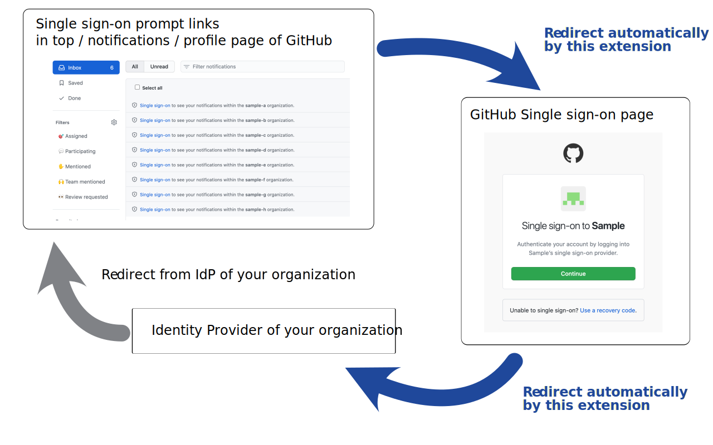

# OctoSSO 

OctoSSO is a browser extension to assist GitHub's single sign-on feature.

## What's the problem?

Even if your session with the Identity Provider is valid, GitHub's single sign-on sessions expire frequently.

Once the session expires, you have to click on each organization's link to authenticate the IdP, and the more organizations that have SSO enabled, the more cumbersome it is.

## How does this web extension solve the problem?

This web extension saves the pain by automatically clicking the Single sign-on link for each organization that prompts on the Top / Notifications / Profile page on GitHub and the Single sign-on page button beyond that.

## License

[MIT](LICENSE)

## Disclaimer

This OSS is unofficial and has no relationship with GitHub, Inc.
